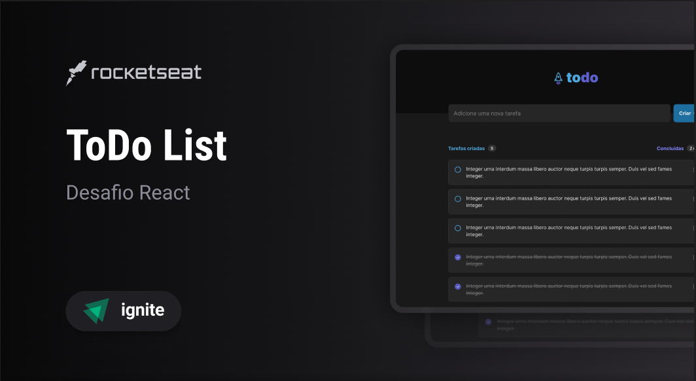

<h1 align="center"> ToDo List </h1>

<p align="center">
Aplicação de controle de tarefas no estilo to-do list. <br/>

</p>

<p align="center">
  <a href="#-tecnologias">Tecnologias</a>&nbsp;&nbsp;&nbsp;|&nbsp;&nbsp;&nbsp;
  <a href="#-projeto">Projeto</a>&nbsp;&nbsp;&nbsp;|&nbsp;&nbsp;&nbsp;
  <a href="#-layout">Layout</a>&nbsp;&nbsp;&nbsp;|&nbsp;&nbsp;&nbsp;
  <a href="#memo-licença">Licença</a>
</p>

<p align="center">
  
</p>

<br>

<p align="center">
  
</p>

## 🚀 Tecnologias

Esse projeto foi desenvolvido com as seguintes tecnologias:

- Typescript
- Node.js
- ReactJs
- Git e Github
- Figma

## 💻 Projeto

O ToDo é uma aplicação de controle de tarefas, que contém as seguintes funcionalidades:

- Adicionar uma nova tarefa
- Marcar e desmarcar uma tarefa como concluída
- Remover uma tarefa da listagem
- Mostrar o progresso de conclusão das tarefas
  
## 🚧 Executando o projeto

**Clone este repositório**

```bash
git clone https://github.com/hidelrios/reactjs-todolist.git
```

**Acesse a pasta**

```bash
cd todo
```

**Instale as dependências e inicie o projeto**

```bash
npm install
```

```bash
npm run dev
```

Abra  http://localhost:5173 em seu browser para ver o resultado.

## 🔖 Layout

Você pode visualizar o layout do projeto através [DESSE LINK](https://www.figma.com/file/zNqY2pnv6HAIaL4J0b8dUO/ToDo-List-%E2%80%A2-Desafio-React-(Copy)?node-id=56%3A96&mode=dev). É necessário ter conta no [Figma](https://figma.com) para acessá-lo.

## :memo: Licença

Esse projeto está sob a licença MIT.

---

Feito com ♥ by Rocketseat :wave: [Participe da nossa comunidade!](https://discord.gg/rocketseat)